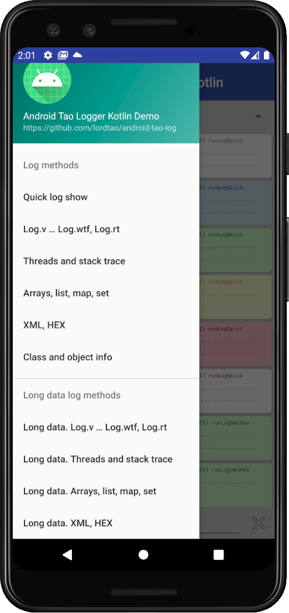
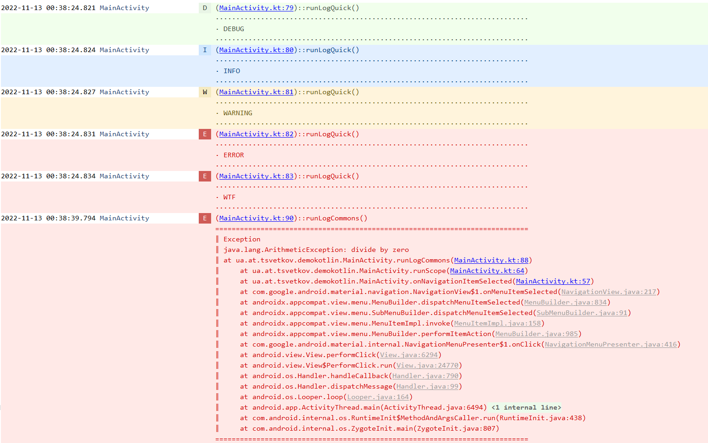
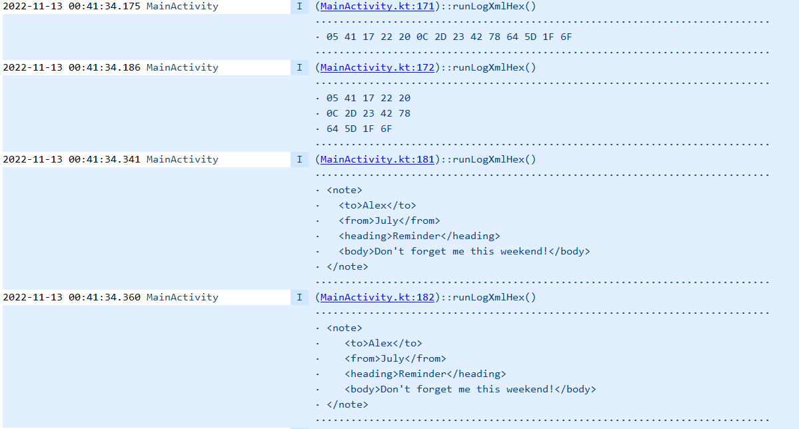
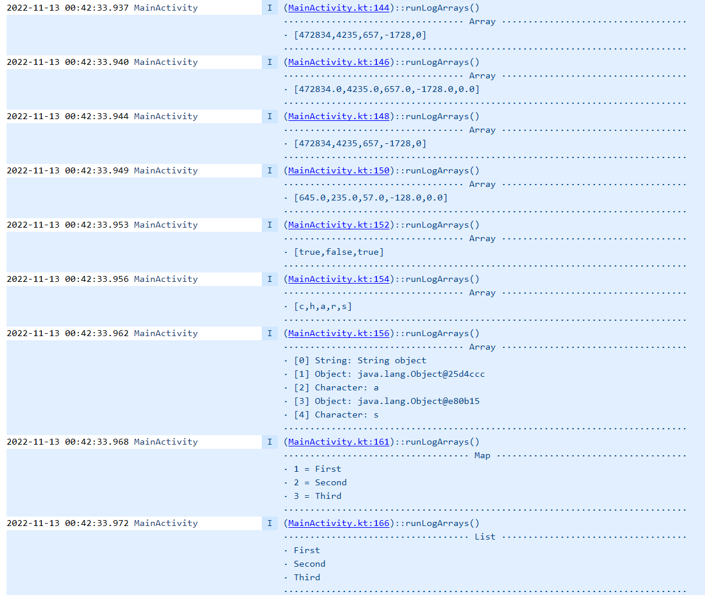
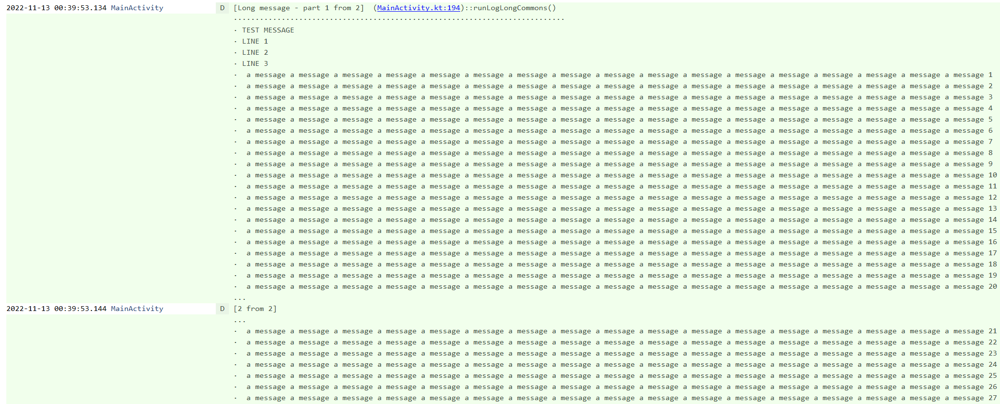
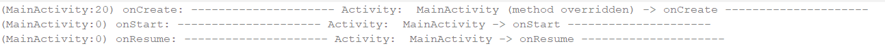
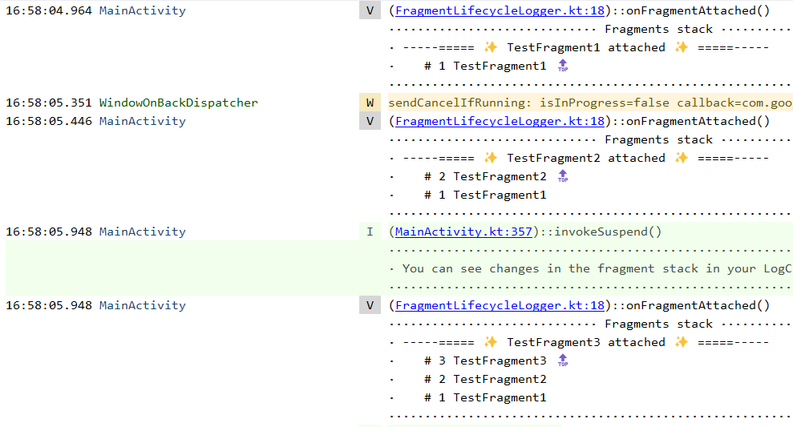
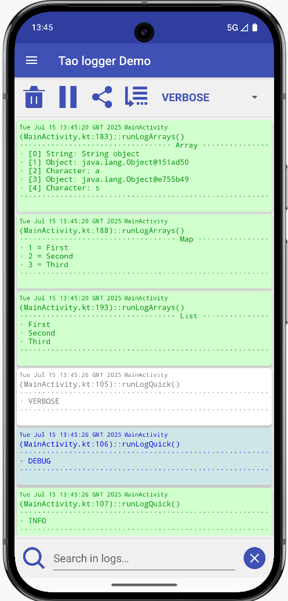
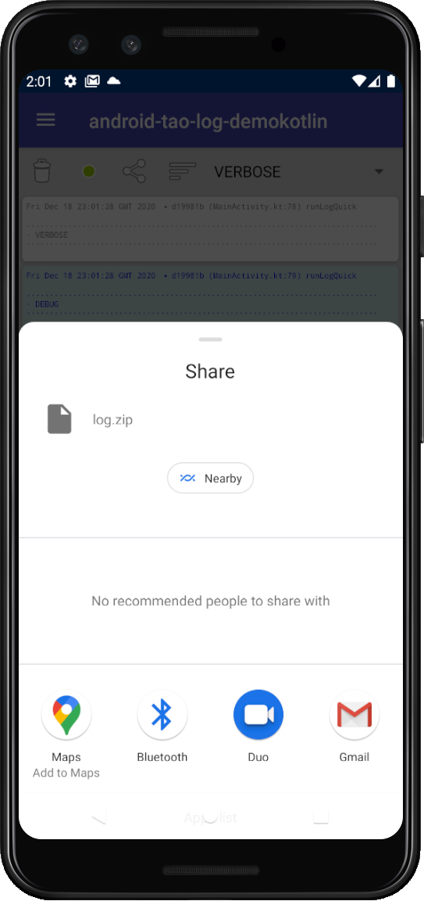

android-tao-log
================

[](https://jitpack.io/#lordtao/android-tao-log)

Tiny, lightweight, informative and very useful logger for Android.

You don't need to define any tags. They are generated automatically and include the file name, method, and line number. Of course, you can quickly jump to that place in the code by clicking on the embedded link in the LogCat.

You also see how Activities and Fragments are launched and destroyed. This is very helpful when parsing unfamiliar code. Insert taolog instead of any old logger, and faceless logs become obvious, with a name and a link.

Also contains the LongLog class which allows you to print a long messages into the LogCat without limiting the standard output length to less than ~ 4075.

[Download the latest release](https://github.com/lordtao/android-tao-log/releases)

**To get a Git project into your build:**

Step 1. Add the JitPack repository to your build file

```
dependencyResolutionManagement {
        repositoriesMode.set(RepositoriesMode.FAIL_ON_PROJECT_REPOS)
        repositories {
            mavenCentral()
            maven { url = uri("https://jitpack.io") }
        }
    }
```

Step 2. Add the dependency

```
dependencies {
            implementation("com.github.lordtao:android-tao-log:latestVersion")
    }
```

**Just try**
[Demo apps](https://github.com/lordtao/android-tao-log/releases)

[Licence](https://opensource.org/license/mit)

<p align="center"></p>

Simple code example
--------------------

You can see more examples in demo applications.

```
   Log.v("Verbose");
   Log.d("Debug");
   Log.i("Info");
   Log.e("Error");
   try{
       int i = 10/0;
   } catch (Exception e) {
       Log.e("Some exception", e);
   }
```

Possibility to outline the log strings (by default). You can also turn off this, just call Log.setLogOutlined(false);

You'll get in your LogCat the lines like below.
Clicking on the tag brings you to log into the source code of the class which was caused by the logger:



Easy objects formatting



Arrays

Long data logger
----------------

Sometimes there is a need to display a log of big data. Usual a loggers truncate it. Use LongLog. It will output all data page by page without loss.


Activity lifecicle and fragments stack logger
---------------------------------------------

Simple add to your Application class.

```
ComponentLog.enableComponentsChangesLogging(this);
```

You will receive information about an activity lifecycle calls



and a changes of the fragments stack


Log interceptor.
-----------------

Allows use all log information in a custom interceptor. 
See the LogToFileInterceptor which save a log messages to file and you can share the zipped log with help of any external applications, for example by email, google drive and etc.

```
public class YourInterceptor extends LogInterceptor {

    @Override
    public void log(Level level, String tag, String msg, @Nullable Throwable th) {
      // Use this data for save the log to file, send to cloud or etc.
    }

}
```

using:

```
Log.addInterceptor(YourInterceptorImplementation)
```

It is also possible to choose ready-made
LogToFileInterceptor and LogToMemoryCacheInterceptor
Log fragment
------------

Allows to use the simple library snippet to display the application log, record, share, filter

```
val logFragment = LogFragment()
supportFragmentManager.beginTransaction().add(R.id.frameContent, logFragment).commit()
```

<p align="center"></p>

Zip and share you log
---------------------

Simple usage - Init at start logging

```
LogToFileInterceptor.init(context)
```

Prepare and run zipper

```
logZipper = LogZipper(LogToFileInterceptor.getSharedInstance(context))
logZipper.shareZip(activity)
```

<p align="center"></p>

Add android-tao-log to your project
-----------------------------------

Android tao log lib is available for direct download (unfortunately Bintray has been deprecated ).  
Please ensure that you are using the [latest releases](https://github.com/lordtao/android-tao-log/releases)

Put downloaded taolog-*.aar file in to the 'lib' directory in your app module and add Gradle dependency:

```
implementation fileTree(dir: "libs", include: ["*.jar", "*.aar"])
implementation files('libs/taolog-*.aar')
```

Changelog
---------

#### 2.2.80 -- Added auto-publishing to jitpack.io

* Added auto-publishing to jitpack.io

#### 2.2.69 -- Migration and refactoring

* Migration to the versions catalog
* Refactoring the lib and demo
* Refactoring logs for Activities and Fragments
* Deleted java demo

#### 2.1.0 -- New LogCat adaptation

* New LogCat adaptation for Android Studio Dolphin | 2021.3.1 Patch 1 and higher

#### 2.0.2 -- Minor update

* Added listW, listE, listV, listE methods

#### 2.0.1 -- Fixes

* Refactoring

#### 2.0.0 -- Migration to Kotlin. LogFragment

* Migration to Kotlin
* Refactoring
* Fixed LogToFileInterceptor
* Added LogToMemoryCacheInterceptor
* Added LogFragment
* Added Log Zipper / Sharing

#### 1.4.10 -- Fixed throwable doubles info

* Fixed throwable doubles info

#### 1.4.8 -- removed annotations

* removed annotations for backward compatibility

#### 1.4.7 -- added ToFileInterceptor

* added ToFileInterceptor

#### 1.4.6 -- Removed @ToLog annotation

* Removed @ToLog annotation.

#### 1.4.5 -- Log interceptor

* Added log interceptor.

#### 1.4.4 -- Activity lifecile and fragments stack logging

* Activity lifecile and fragments stack logging moved to ComponentLog class.
* Added LongLog for possibility print to LogCat very long messages.

#### 1.4.3 -- Activity lifecile and fragments stack logging

* Activity lifecile and fragments stack logging updates

#### 1.4.1 -- ToLog annotation

* added Kotlin classes support;
* added possibility to align to right new lines in log for AndroidStudio 3.1;
* combined @ToLog results in/out to one output method.

#### 1.4.0 -- ToLog annotation

* added support @ToLog annotation;
* added outline log possibility;
