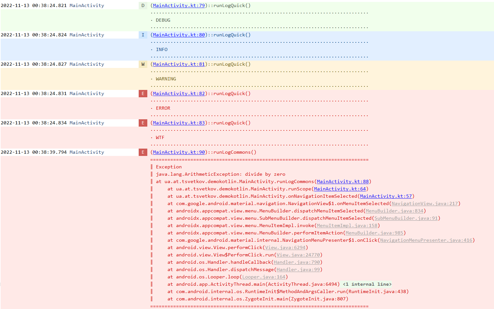
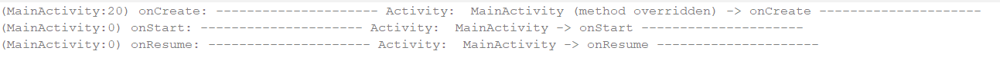

android-tao-log
================

Tiny, lightweight, informative and very usefull logger for Android.
You don't need to define TAG. It is automatically generated and include file name, method, line nuber and of cource the link to the code.
Also contains the LongLog class which allows you to print a long messages into the LogCat without limiting the standard output length to less than ~ 4075.
See in [demo app](https://github.com/lordtao/android-tao-log/tree/master/logdemo)

[](https://android-arsenal.com/api?level=14)
Download from Bintray: [  ](https://bintray.com/lordtao/maven/android-tao-log/_latestVersion)

Warning! Android Studio 3.1 Logcat prefix not always showing and breaking logger. 
According to the [Google issue tracker](https://issuetracker.google.com/issues/77305804) it is fixed and is planned for Android Studio 3.2.

Code example:

```java
   Log.v("Verbose");
   Log.d("Debug");
   Log.i("Info");
   Log.e("Error");
   try{
       int i = 10/0;
   } catch (Exception e) {
       Log.e("Some exception", e);
   }
   try{
       int i = 10/0;
   } catch (Exception e) {
       Log.rt("RuntimeException is not handled by Log.rt()", e);
   }
```

Possibility to outline the log strings (by default). You can also turn off this, just call Log.setLogOutlined(false);

You'll get in your LogCat the lines like below.
Clicking on the tag brings you to log into the source code of the class which was caused by the logger:



Activity lifecicle and fragments stack logger
---------------------------------------------
Simple add to your Application class.
```
ComponentLog.enableComponentsChangesLogging(this);
```

You will receive information about an activity lifecycle calls



and a changes of the fragments stack


Log interceptor.
--------------------------------------------------------------
Allows use all log information in a custom interceptor. 
See the LogToFileInterceptor which save a log messages to file and you can share the zipped log with help of any external applications, for example by email, google drive and etc.
```
public class YourInterceptor extends LogInterceptor {

    @Override
    public void log(Level level, String tag, String msg, @Nullable Throwable th) {
      // Use this data for save the log to file, send to cloud or etc.
    }

}
```

using:

```
Log.addInterceptor(YourInterceptorImplementation)
```

Add android-tao-log to your project
-----------------------------------
Android tao log lib is available on Bintray. Please ensure that you are using the latest versions by [  ](https://bintray.com/lordtao/maven/android-tao-log/_latestVersion)

Gradle dependency for your Android app:

add to general build.gradle
```
buildscript {
    repositories {
        jcenter()
        maven {
            url  "http://dl.bintray.com/lordtao/maven"
        }
    }
    dependencies {
        classpath 'com.android.tools.build:gradle:3.0.1'
    }
}

allprojects {
    repositories {
        jcenter()
        maven {
            url  "http://dl.bintray.com/lordtao/maven"
        }
    }
}
```
add to your dependencies in build.gradle
```
    compile 'ua.at.tsvetkov:taolog:1.4.6@aar'
```

Changelog
---------
#### 1.4.10 -- Fixed throwable doubles info
* Fixed throwable doubles info

#### 1.4.9 -- Fix class name for activity component logging
* Fix class name for activity component logging

#### 1.4.8 -- removed annotations
* removed annotations for backward compatibility

#### 1.4.7 -- added ToFileInterceptor
* added ToFileInterceptor

#### 1.4.6 -- Removed @ToLog annotation
* Removed @ToLog annotation.

#### 1.4.5 -- Log interceptor
* Added log interceptor.

#### 1.4.4 -- Activity lifecile and fragments stack logging
* Activity lifecile and fragments stack logging moved to ComponentLog class.
* Added LongLog for possibility print to LogCat very long messages.

#### 1.4.3 -- Activity lifecile and fragments stack logging
* Activity lifecile and fragments stack logging updates

#### 1.4.1 -- ToLog annotation
* added Kotlin classes support;
* added possibility to align to right new lines in log for AndroidStudio 3.1;
* combined @ToLog results in/out to one output method.

#### 1.4.0 -- ToLog annotation
* added support @ToLog annotation;
* added outline log possibility;
