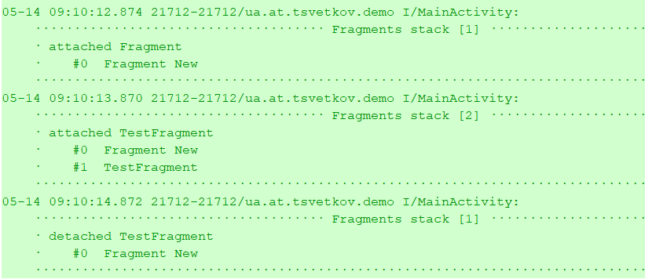

android-tao-log
================

Tiny, lightweight, informative and very usefull logger for Android.
You don't need to define TAG. It is automatically generated and include file name, method, line nuber and of cource the link to the code.
See in demo app (https://github.com/lordtao/android-tao-log/tree/master/logdemo)

[](https://android-arsenal.com/api?level=14)
Download from Bintray: [  ](https://bintray.com/lordtao/maven/android-tao-log/_latestVersion)

Code example:

```java
   Log.v("Verbose");
   Log.d("Debug");
   Log.i("Info");
   Log.e("Error");
   try{
       int i = 10/0;
   } catch (Exception e) {
       Log.e("Some exception", e);
   }
   try{
       int i = 10/0;
   } catch (Exception e) {
       Log.rt("RuntimeException is not handled by Log.rt()", e);
   }
```

Possibility to outline the log strings (by default). You can also turn off this, just call Log.setLogOutlined(false);

You'll get in your LogCat the lines like below.
Clicking on the tag brings you to log into the source code of the class which was caused by the logger:


Activity lifecicle and fragments stack logger
---------------------------------------------
Simple add to your Application class.
```
Log.enableComponentsChangesLogging(this);
```

You will receive information about an activity lifecycle calls


and a changes of the fragments stack



@ToLog annotatin for constructors and methods.
--------------------------------------------------------------
Experemental!!! AspectJ plugin incompatibility with java 8. Will be fixed soon in 3.3.0 AspectJ plugin
Simply add @ToLog to your methods/constructors and you will automatically get all of the things listed

```
public class Boo {

    private final boolean isNeed;

    @ToLog
    public Boo(boolean isNeed) {
        this.isNeed = isNeed;
    }

    @ToLog
    public boolean isNeed() {
        return isNeed;
    }

}
```
you will got something like:
```
(MainActivity.java:33) runToLogAnnotationsExamples    ⇛: ⇢ <init Boo> (isNeed=true)
(MainActivity.java:33) runToLogAnnotationsExamples    ⇛: ⇠ <init Boo> [0ms]
(MainActivity.java:34) runToLogAnnotationsExamples    ⇛: ⇢ isNeed ()
(MainActivity.java:34) runToLogAnnotationsExamples    ⇛: ⇠ isNeed [0ms] = true
```

The idea is taken from Jake Wharton's [Hugo] (https://github.com/JakeWharton/hugo)
In addition, I used Archinamon's AspectJ plugin [GradleAspectJ-Android] (https://github.com/Archinamon/android-gradle-aspectj)

Add android-tao-log to your project
-----------------------------------
Android tao log lib is available on Bintray. Please ensure that you are using the latest versions by [  ](https://bintray.com/lordtao/maven/android-tao-log/_latestVersion)

Gradle dependency for your Android app:

add to general build.gradle
```
buildscript {
    repositories {
        jcenter()
        maven {
            url  "http://dl.bintray.com/lordtao/maven"
        }
    }
    dependencies {
        classpath 'com.android.tools.build:gradle:3.0.1'
    }
}

allprojects {
    repositories {
        jcenter()
        maven {
            url  "http://dl.bintray.com/lordtao/maven"
        }
    }
}
```
add to your dependencies in build.gradle
```
    compile 'ua.at.tsvetkov:taolog:1.4.1@aar'
```

For use @ToLog annotation please add to build.gradle. 
-----------------------------------------------------

```
dependencies {
        classpath 'com.archinamon:android-gradle-aspectj:3.2.0'
    }
```

```
apply plugin: 'com.archinamon.aspectj-ext'
```

and
```
aspectj {
    includeAspectsFromJar 'taolog'
}
```

If you have an issues with build your project, please read the Archinamon's AspectJ plugin docs [GradleAspectJ-Android] (https://github.com/Archinamon/android-gradle-aspectj)
For example, to build a multidex project you will need to turn off the InstantRun

Changelog
---------
#### 1.4.1 -- ToLog annotation
* added Kotlin classes support;
* added possibility to align to right new lines in log for AndroidStudio 3.1;
* combined @ToLog results in/out to one output method.

#### 1.4.0 -- ToLog annotation
* added support @ToLog annotation;
* added outline log possibility;
